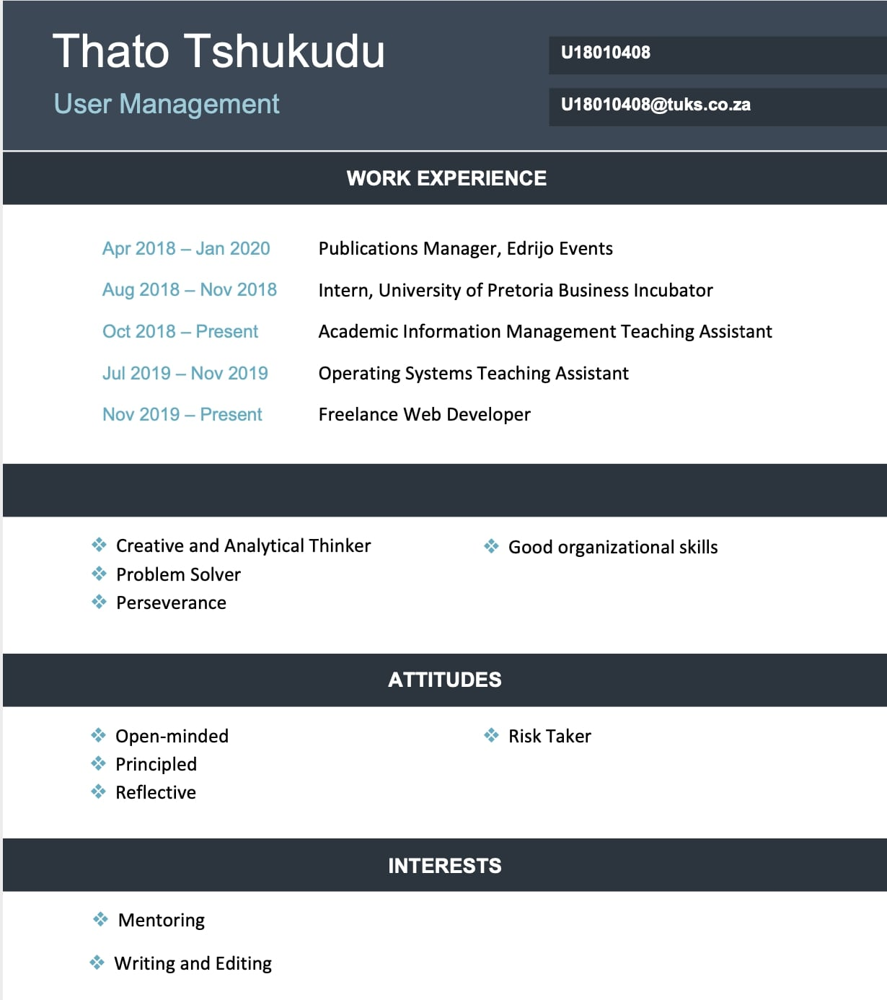

     
<b><h3> Mini Project Contributions </h3></b>

        Unit Tests
          <ul> 
               <li>Set up and conducted automated tests on Postman for <i>Reset</i>, <i>Recover</i> and <i>Encryption</i> models.       </li> 
          </ul>
        
        Coding and Implementation
        <ul> 
             <li> Developed the Encryption model for the API (Encryption.php) </li>
             <li> Set up the Request model for the API (Request.php) </li>
             <li> Worked on initial Update model </li>
             <li> Worked on Response Object model (ResponseObject.php) </li>
               </ul>
        

